# Multi-Agent Stock Analysis System - Architecture Diagram

## 🏗️ High-Level System Architecture

```mermaid
graph TB
    subgraph "External APIs"
        API1[Yahoo Finance<br/>yfinance]
        API2[Alpha Vantage<br/>Financial Data]
        API3[Financial Modeling Prep<br/>Fundamentals]
        API4[News APIs<br/>Sentiment Data]
        API5[Social Media APIs<br/>Twitter/Reddit]
    end

    subgraph "Multi-Agent Stock Analysis System"
        subgraph "Main Orchestrator"
            ORCH[Stock Analysis Orchestrator<br/>🎯 Coordination & Routing]
            DEP[Dependency Resolver<br/>📊 Execution Order]
        end

        subgraph "Core Infrastructure"
            MSG[Message Bus<br/>📡 Async Communication]
            CFG[Configuration Manager<br/>⚙️ YAML Config]
            LOG[Logging System<br/>📝 Structured Logs]
        end

        subgraph "Data Layer"
            CACHE[(Redis Cache<br/>⚡ Data Caching)]
            DB[(PostgreSQL<br/>📊 Data Storage)]
            SHARED[Shared Data Models<br/>📋 Type Safety]
        end

        subgraph "Specialized Agents - Level 0"
            DC[Data Collector Agent<br/>📥 Multi-API Fetching<br/>🔄 Rate Limiting<br/>💾 Caching]
        end

        subgraph "Analysis Agents - Level 1"
            TA[Technical Analysis Agent<br/>📈 RSI, MACD, Bollinger<br/>🎯 Trading Signals<br/>📊 Pattern Recognition]
            FA[Fundamental Analysis Agent<br/>🏢 PE, ROE, Debt Ratios<br/>💰 DCF Modeling<br/>🎯 Investment Recommendations]
            RA[Risk Assessment Agent<br/>⚠️ VaR, Beta, Volatility<br/>📉 Drawdown Analysis<br/>🛡️ Risk Scoring]
            SA[Sentiment Analysis Agent<br/>💭 News Sentiment<br/>📱 Social Media<br/>👥 Analyst Recommendations]
        end

        subgraph "Output Agents - Level 2"
            VA[Visualization Agent<br/>📊 Interactive Charts<br/>🎨 Multi-format Output<br/>📈 Technical Indicators]
        end

        subgraph "Report Agents - Level 3"
            RG[Report Generation Agent<br/>📋 Comprehensive Reports<br/>💼 Executive Summaries<br/>🎯 Actionable Insights]
        end
    end

    subgraph "Output & Storage"
        REPORTS[Reports Directory<br/>📄 JSON Reports<br/>📊 Chart Specifications<br/>📈 Analysis Results]
        CHARTS[Charts Directory<br/>🎨 Visualization Data<br/>📊 Interactive Charts<br/>📈 Technical Plots]
        LOGS[Log Files<br/>📝 System Logs<br/>🔍 Debug Info<br/>📊 Performance Metrics]
    end

    subgraph "User Interfaces"
        CLI[Command Line Interface<br/>💻 Direct Execution]
        API_IF[REST API<br/>🌐 HTTP Endpoints<br/>(Future)]
        WEB[Web Dashboard<br/>🖥️ Interactive UI<br/>(Future)]
    end

    %% API Connections
    API1 --> DC
    API2 --> DC
    API3 --> DC
    API4 --> SA
    API5 --> SA

    %% Orchestrator Connections
    ORCH --> MSG
    ORCH --> DEP
    ORCH --> CFG
    ORCH --> LOG

    %% Infrastructure Connections
    MSG --> DC
    MSG --> TA
    MSG --> FA
    MSG --> RA
    MSG --> SA
    MSG --> VA
    MSG --> RG

    %% Data Flow
    DC --> CACHE
    DC --> DB
    DC --> SHARED

    %% Agent Dependencies (Level Flow)
    DC --> TA
    DC --> FA
    DC --> RA
    DC --> SA
    TA --> VA
    FA --> VA
    RA --> VA
    SA --> VA
    VA --> RG

    %% Output Generation
    VA --> CHARTS
    RG --> REPORTS
    LOG --> LOGS

    %% User Interfaces
    CLI --> ORCH
    API_IF -.-> ORCH
    WEB -.-> ORCH

    %% Styling
    classDef orchestrator fill:#ff6b6b,stroke:#d63031,stroke-width:3px,color:#fff
    classDef infrastructure fill:#4ecdc4,stroke:#00b894,stroke-width:2px,color:#fff
    classDef level0 fill:#fd79a8,stroke:#e84393,stroke-width:2px,color:#fff
    classDef level1 fill:#fdcb6e,stroke:#e17055,stroke-width:2px,color:#fff
    classDef level2 fill:#6c5ce7,stroke:#5f3dc4,stroke-width:2px,color:#fff
    classDef level3 fill:#a29bfe,stroke:#6c5ce7,stroke-width:2px,color:#fff
    classDef external fill:#95e1d3,stroke:#00b894,stroke-width:2px,color:#333
    classDef output fill:#ffeaa7,stroke:#fdcb6e,stroke-width:2px,color:#333
    classDef data fill:#fab1a0,stroke:#e17055,stroke-width:2px,color:#fff

    class ORCH,DEP orchestrator
    class MSG,CFG,LOG infrastructure
    class DC level0
    class TA,FA,RA,SA level1
    class VA level2
    class RG level3
    class API1,API2,API3,API4,API5 external
    class REPORTS,CHARTS,LOGS output
    class CACHE,DB,SHARED data
```

## 🔄 Agent Communication Flow


## 🏛️ Detailed Agent Architecture


## 📊 Data Model Architecture


## 🚀 Deployment Architecture (Future)

```mermaid
graph TB
    subgraph "Production Environment"
        subgraph "Load Balancer"
            LB[NGINX<br/>Load Balancer<br/>🔄 Traffic Distribution]
        end

        subgraph "Application Tier"
            APP1[App Instance 1<br/>🐳 Docker Container]
            APP2[App Instance 2<br/>🐳 Docker Container]
            APP3[App Instance N<br/>🐳 Docker Container]
        end

        subgraph "Message Queue"
            REDIS[Redis Cluster<br/>⚡ Message Bus<br/>💾 Caching Layer]
            CELERY[Celery Workers<br/>⚙️ Background Tasks]
        end

        subgraph "Database Layer"
            POSTGRES[PostgreSQL<br/>📊 Primary Database<br/>🔄 Read Replicas]
            TIMESERIES[InfluxDB<br/>📈 Time Series Data<br/>📊 Metrics Storage]
        end

        subgraph "External Services"
            APIS[External APIs<br/>📡 Financial Data<br/>🔄 Rate Limited]
            MONITORING[Monitoring<br/>📊 Prometheus<br/>📈 Grafana]
        end

        subgraph "Storage"
            S3[Object Storage<br/>📄 Reports<br/>📊 Chart Files]
            LOGS_STORE[Log Storage<br/>📝 ELK Stack<br/>🔍 Centralized Logging]
        end
    end

    subgraph "Development Environment"
        DEV[Development<br/>💻 Local Docker<br/>🧪 Testing Environment]
    end

    subgraph "CI/CD Pipeline"
        GIT[Git Repository<br/>📋 Source Code]
        CI[GitHub Actions<br/>🔄 Automated Testing<br/>📦 Docker Build]
        REG[Docker Registry<br/>📦 Container Images]
    end

    %% Connections
    LB --> APP1
    LB --> APP2
    LB --> APP3

    APP1 --> REDIS
    APP2 --> REDIS
    APP3 --> REDIS

    APP1 --> POSTGRES
    APP2 --> POSTGRES
    APP3 --> POSTGRES

    REDIS --> CELERY
    CELERY --> TIMESERIES
    
    APP1 --> APIS
    APP2 --> APIS
    APP3 --> APIS

    APP1 --> S3
    APP2 --> S3
    APP3 --> S3

    APP1 --> LOGS_STORE
    APP2 --> LOGS_STORE
    APP3 --> LOGS_STORE

    MONITORING --> APP1
    MONITORING --> APP2
    MONITORING --> APP3
    MONITORING --> POSTGRES
    MONITORING --> REDIS

    %% CI/CD Flow
    GIT --> CI
    CI --> REG
    REG --> APP1
    REG --> APP2
    REG --> APP3

    DEV --> GIT

    %% Styling
    classDef production fill:#00b894,stroke:#00a085,stroke-width:3px,color:#fff
    classDef infrastructure fill:#0984e3,stroke:#074ea0,stroke-width:2px,color:#fff
    classDef storage fill:#fd79a8,stroke:#e84393,stroke-width:2px,color:#fff
    classDef cicd fill:#6c5ce7,stroke:#5f3dc4,stroke-width:2px,color:#fff

    class LB,APP1,APP2,APP3 production
    class REDIS,CELERY,POSTGRES,TIMESERIES,APIS,MONITORING infrastructure
    class S3,LOGS_STORE storage
    class GIT,CI,REG,DEV cicd
```



This comprehensive architecture diagram shows:

1. **🏗️ High-Level System Architecture** - Complete system overview with all components
2. **🔄 Agent Communication Flow** - Sequence diagram showing request processing
3. **🏛️ Detailed Agent Architecture** - Base classes and specialization hierarchy  
4. **📊 Data Model Architecture** - Class relationships and data flow
5. **🚀 Deployment Architecture** - Production-ready scaling and infrastructure

The system demonstrates a sophisticated multi-agent architecture with proper separation of concerns, scalable design, and production-ready infrastructure planning.